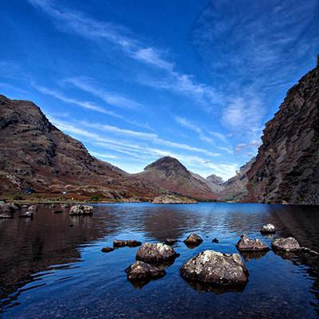

## using the carver package

using the carver package in your own projects is pretty simple, you need to import it like so

```go
import "github.com/OSokunbi/image-carve/carver"
```

then run
```bash
go get -u github.com/OSokunbi/image-carve/carver
```

there is a total of 4 functions that you can use from the carver package

1. `carver.Carve` - this function takes in am image as well as a target height and width for that image and returns a new image that is the target height and width

2. `carver.Rotate90` - this function takes in an image and returns a new image that is rotated 90 degrees

3. `carver.RotateMinus90` - this function takes in an image and returns a new image that is rotated -90 degrees

4. `caver.Energy` - this function takes in an image and calculates the energy of each pixel in the image, returning this as a 2D slice of floats

Examples of how to use these functions can be found in the `main.go` file in the root of this repository

## running main.go

to run the `main.go` file in the root of this repository, you can use the following command:

```bash
go build main.go
```

this will create an executable file called `main` in the root of the repository, you can then run this file using the following command:

```bash
./main -filename=<path to image> -height=<target height> -width=<target width>
```

where:
```
- `<path to image>` is the path to the image you want to carve
- `<target height>` is the target height of the new image
- `<target width>` is the target width of the new image
```

a new jpg image will be saved in the root of the repository with the name `output.jpg`

here's an example, take an original image


it originally has the following dimensions

```
width: 800px
height: 400px
```

say you wanted to resize this image for a profile picture, but its originally to large to make it your profile pictyre without losing a lot of import details in the image, you could resize it like so

```bash
./main -filename=./images/example.jpg -height=400 -width=400
```

the image now has the following dimensions

```
width: 400px
height: 400px
```
and looks like this

 

peace :P

# ʕ˙Ⱉ˙ʔ rawr!
